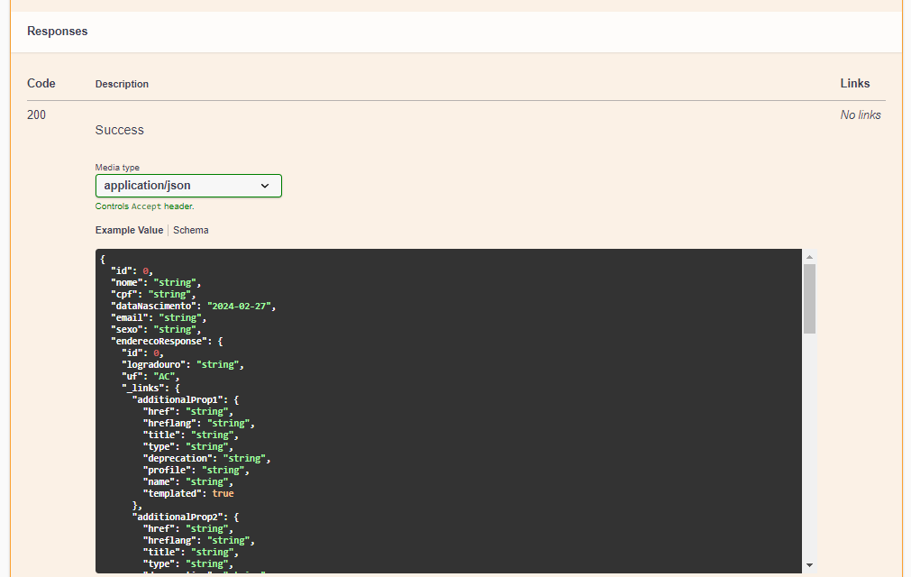

**OBS.: Como estou treinando inglês, decidi escrever o README em inglês, mas para facilitar a leitura de visitantes, 
deixarei a tradução de cada texto para o português também. Todos os textos escritos em inglês ficarão em itálico
e começarão com o simbolo "->". Cada texto em ingles ficara abaixo do texto de tradução para o português.**

# Oficina API

Este é um projeto criado com fins educacionais. Ele representa uma API para uma oficina mecânica.
A API oferece serviços como: Registro e gerenciamento de clientes, veículos, serviços e vendas.

*-> This is a project created for educational purposes. It represents an API for a machine workshop.
The API offers services such as: Registration and management of customers, vehicles, services and sales.*

A seguir, irei usar imagens da documentação da API desenvolvida com a biblioteca do Swagger API para explicar cada
endpoint em detalhes

*-> Below, I will use images from the API documentation developed with the Swagger API library to explain each endpoint in detail.*

## PessoaRestController (Customer)

Este é o primeiro controller que irei explicar. A imagem abaixo mostra todos os endpoints do controller de pessoa (clientes).

*-> This is the first controller I will explain. The image below shows all the person controller endpoints (customers)*

**O controller de pessoa possui 5 endpoints sendo eles:**

***-> The person controller has 5 endpoints:***

### Salvando novo cliente (Saving a new customer) "/api/pessoas/{placa}"

Este endpoint POST recebe um path param (placa do carro) e um objeto no corpo da requisição.
A API vai validar os valores do objeto usando a biblioteca Jakarta.validation.constraints e validar a placa do carro
A logica para salvar o cliente é: Se houver um cliente no banco de dados que tenha o mesmo nome (nome completo) que o
cliente que está sendo salvo e se houver um veiculo no banco de dados que contenha a mesma placa que foi passada
no request param, a API entende que este cliente é repetido e retorna um erro. Caso contrário, o cliente é salvo com
sucesso.

*-> This POST endpoint receives a request param (car plate) and an object in the request body.
The API will validate the object's values using the Jakarta.validation.constraints library and validate the car plate
The logic for saving a new customer is: If there is a customer in the database that has the same name (full name)
as the customer being saved and if there is a vehicle in the database that contains the same car plate that was passed
in request param, the API understands that this customer is retried and returns an error. Otherwise, the
customer is saved with success*

**Respostas**

***Responses***

- 201 OK: Caso o cliente seja salvo com sucesso, a API retorna um objeto contendo os dados do cliente.
- *-> 201 OK: If the customer is saved successfully, the API returns an object containing the customer's data.*

- 409 CONFLICT: Se a validação dos dados e placa falharem, a API irá retornar um objeto contendo detalhes do erro
- *-> 409 CONFLICT: If the data validation fail, the API will return an object containing the error details*

---

### Buscando cliente pelo ID (Find a customer by ID) "/api/pessoas/{id}"

Ao chamar esse endpoint, o usuário passa o ID em um path param.
A API vai buscar um cliente no banco de dados que tenha esse mesmo ID. Se achar, retorna os dados do cliente, caso
contrário, um 404 NOT FOUND será retornado com o mesmo objeto que foi retornado no 409 do endpoint anterior, mas com
os detalhes atualizados.

*-> When calling this endpoint, the user passes the ID in a path param.
The API will search for a customer in the database that has the same ID. If found, return the customer data, otherwise, 
a 404 NOT FOUND will be returned with the same object that was returned in the 409 of the previous endpoint, but with the
updated details.*

---

### Buscando todas as pessoas (Find all people) "/api/pessoas"

Esse é o endpoint usado para buscar todas as pessoas cadastradas no banco de dados.
Ao ser chamado ele retorna uma lista paginada e cada página contém, no máximo, 5 resultados (clientes).
Ao final de cada página existem links HATEOAS para navegação pelas páginas, podendo ir para a próxima, anterior, ultima
e primeira página.
Se não existir nenhum registro no banco de dados, a API retorna um 404 NOT FOUND.

*-> This is the endpoint used to find all people registered in the database.
When called it returns a paginated list and each page contains a maximum of 5 records (customers).
At the end of each page exists HATEOAS links to navigation between the pages, being able to go to next, previous, last and 
first page.
If not exists any records in the database, the API returns a 404 NOT FOUND*

---

### Buscando pessoa pelo nome (Find a person by name) "/api/pessoas/findByNome/{nome}"

Esse é o endpoint usado para buscar uma ou mais pessoas pessoas pelo nome. O usuário digita uma parte do nome ou o nome 
completo e faz a busca. Se houverem registros com nome igual, a API retorna uma lista com todos.
Se não, um 404 NOT FOUND é lançado.

*-> This is the endpoint used to search one or more people by name. The user types a part of the name or the full name 
and search. If there are records with the same name, the API return a list with all. If not, a 404 NOT FOUND is thrown*

---

### Atualizando dados de uma pessoa (Update a person's data) "/api/pessoas/{id}"

Este é o utlimo endpoint do controller de pessoas. Ele é chamado quando o usuário faz uma requisição para mudar 
os dados cadastrais de uma pessoa. Esses dados podem ser pessoais ou até o endereço.
Esse endpoint recebe um ID que será o ID da pessoa que vai ser atualizada e um objeto que contém os dados já atualizados.
A API vai verificar se existe a pessoa com o ID passado. Se existir, os dados dela são atualizados, se não, a API lança 
um 404 NOT FOUND dizendo que não existem clientes com o ID passado.

*-> This is the last endpoint of the Pessoa controller. It is called when the user makes a request to update a person's
registration data. This data can be personal or even the address. This endpoint receives an ID that will be the person ID 
who will be updated and an object that contains the already updated data. The API will check if the person with the given 
ID exists. If yes, its data is updated, if not, the API thown a 404 NOT FOUND saying that there are no customers with 
the given ID*

## Outros controllers (Other controllers)

Como o intuito do README é oferecer um passo a passo de como usar a API, para os próximos controllers, deixarei apenas as fotos 
e um tópico explicando os path params que são passados.

*-> As the purpose of the README is to offer a step-by-step of how to use the API, for the next controllers, I will leave just 
the photos and a topic explaining the path params that are passed.*

## EnderçoRestController (Address)

Esse é o controller com os endpoints para gerenciar os endereços cadastrados. Os endereços são relacionados com as pessoas
(clientes) no banco de dados

*-> This is the controller with the endpoints to manage registered addresses. The addresses are related with the people
(customers) in the database*

### Salvar Endereço (Save an Address) "/api/enderecos"

